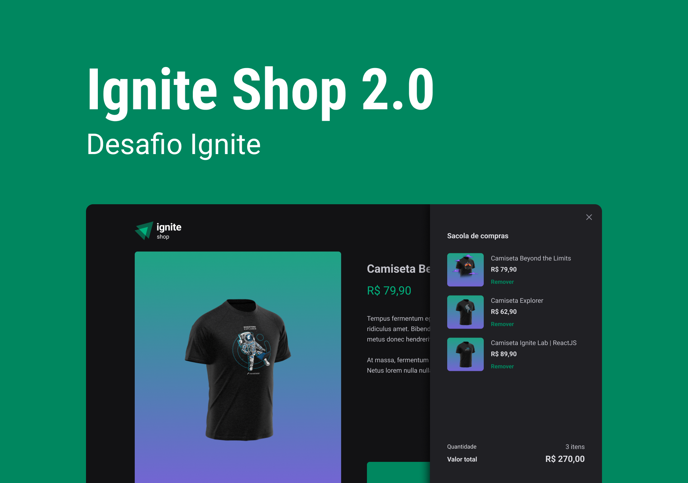

<h1 align="center">
    
</h1>

## 💻 Sobre

Este é um projeto de uma Loja Virtual de Camisetas desenvolvido com Next.js e Stripe. O objetivo principal é fornecer uma experiência de compra simples e eficiente, utilizando tecnologias modernas para garantir alta performance e segurança no processo de pagamento.

<p>
  
</p>

## Layout

Você pode visualizar o layout do projeto através [desse link](https://www.figma.com/file/FxlDRKOmznBbTH8DsTgnZU/Ignite-Shop-2.0/duplicate).

## 🚀 Funcionalidades

- **Listagem de Produtos**: Consumo da API do Stripe para cadastrar, listar e exibir produtos.
- **Carrinho de Compras**: Totalmente funcional, com integração direta ao sistema de pagamentos do Stripe.
- **Otimização de SEO**: Uso de práticas recomendadas para melhorar a indexação da página pelos mecanismos de busca.
- **SSR e SSG**: Uso de Server-Side Rendering e Static Site Generation para otimização de performance e redução da carga no servidor.

## 🛠️ Tecnologias Utilizadas

- **ReactJS**: Biblioteca JavaScript para construção de interfaces de usuário.
- **TypeScript**: Tipagem estática para maior segurança e produtividade no código.
- **Next.js**: Framework para React, utilizado para implementar SSR e SSG.
- **Stripe**: Plataforma para processamento de pagamentos.
- **Stitches**: Biblioteca de CSS-in-JS para estilização do projeto.
- **Axios**: Cliente HTTP para realizar as requisições à API do Stripe.
- **Phosphor Icons**: Ícones minimalistas para melhorar o visual da aplicação.
- **Keen Slider**: Biblioteca para criação de carrosséis responsivos.
- **RadixUI**: Componentes acessíveis e personalizáveis para UI.
- **embla-carousel-react**: Biblioteca para carrosséis com ótima performance.
- **ESLint**: Ferramenta de linting para garantir a qualidade do código.

## 📦 Como Instalar e Executar o Projeto

1. Clone o repositório:

```bash
 git clone https://github.com/Futila/ignite-shop.git

```

2. Navegue até o diretório do projeto:

```bash
 cd ignite-shop

```

3. Instale as dependências:

```bash
  npm install
  # ou
  yarn install

```

4. Crie um arquivo .env.local na raiz do projeto e adicione suas credenciais do Stripe:

```bash
 #App
NEXT_URL=suaapiurl

# Stripe
STRIPE_PUBLIC_KEY=suachavepublica
STRIPE_SECRET_KEY=suachavesecreta
```

5. Inicie o servidor de desenvolvimento:

```bash
npm run dev
# ou
yarn dev
```

6. Abra o navegador e acesse: http://localhost:3000

## Meta

Author - Rockeseat.

Programmer - [Fernando Futila] - fernando.futila@gmail.com

---

Feito com 💜 by Fernando Futila 👋🏻
